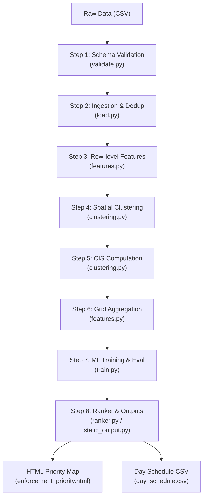

# GridLock R2 — PS1: Parking-Induced Congestion

Welcome to **GridLock R2**, an end-to-end machine learning pipeline and enforcement prioritization system designed to mitigate parking-induced congestion in Bengaluru. Using historical police violation datasets, the system identifies high-density parking violation zones, models temporal violation patterns, integrates a custom **Congestion Impact Score (CIS)**, and outputs actionable, ranked schedules and interactive maps for traffic enforcement deployment.

---

## 🗺️ Project Architecture & Workflow

The system is organized as an 8-step pipeline, flowing from raw CSV ingestion to interactive web map priority alerts. 



---

## 📁 Repository Directory Structure

Below is the layout of the project workspace. Click on any file link to view the file directly:

| Directory/File | Description |
| :--- | :--- |
| **`configs/`** | Central configuration files (strictly no hardcoded parameters in python code) |
| ├── [features.yaml](file:///c:/Users/USER/Desktop/GridLock%20R2/configs/features.yaml) | Configures temporal, spatial, historical, and target columns, encoding registries, and exclusions. |
| ├── [eval.yaml](file:///c:/Users/USER/Desktop/GridLock%20R2/configs/eval.yaml) | Defines train/test splits, NDCG quartile grades, the CIS formula, and ranker thresholds. |
| └── [model.yaml](file:///c:/Users/USER/Desktop/GridLock%20R2/configs/model.yaml) | Manages DBSCAN hyperparams, time resolution, regression models (XGB/LGB/CatBoost) and checkpoints. |
| **`src/`** | Core Python modules containing the library code |
| ├── **`data/`** | Data ingestion, validation, and feature preparation |
| │   ├── [validate.py](file:///c:/Users/USER/Desktop/GridLock%20R2/src/data/validate.py) | Standalone validator performing 8 schema checks before ingestion. |
| │   ├── [load.py](file:///c:/Users/USER/Desktop/GridLock%20R2/src/data/load.py) | Ingests raw CSV data, filters columns, and performs minute-level deduplication. |
| │   ├── [features.py](file:///c:/Users/USER/Desktop/GridLock%20R2/src/data/features.py) | Implements row-level engineering (Phase A) and zone-grid rollups (Phase B). |
| │   └── [pipeline.py](file:///c:/Users/USER/Desktop/GridLock%20R2/src/data/pipeline.py) | End-to-end orchestrator executing all 8 steps sequentially or with skip-flags. |
| ├── **`models/`** | Spatial and density clustering models |
| │   └── [clustering.py](file:///c:/Users/USER/Desktop/GridLock%20R2/src/models/clustering.py) | Executes DBSCAN coordinates scaling, cluster mapping, and CIS scores mapping. |
| ├── **`training/`** | Model training and candidate comparisons |
| │   └── [train.py](file:///c:/Users/USER/Desktop/GridLock%20R2/src/training/train.py) | Trains and compares XGBoost, LightGBM, and CatBoost models under a leakage-free temporal split. |
| ├── **`evaluation/`** | Metrics calculation and scoring |
| │   └── [metrics.py](file:///c:/Users/USER/Desktop/GridLock%20R2/src/evaluation/metrics.py) | Computes regression MAE/RMSE, ranking NDCG@K, Precision@K, and naive mean baselines. |
| └── **`inference/`** | Inference, prioritization, and static visualization generation |
|     ├── [ranker.py](file:///c:/Users/USER/Desktop/GridLock%20R2/src/inference/ranker.py) | Scaffolds zone queries, predicts violation counts, and ranks zones by priority score. |
|     └── [static_output.py](file:///c:/Users/USER/Desktop/GridLock%20R2/src/inference/static_output.py) | Compiles folium maps and HTML scoreboard panels. |
| **`notebooks/`** | Interactive, step-by-step walkthroughs corresponding to pipeline phases |
| ├── [01_eda.ipynb](file:///c:/Users/USER/Desktop/GridLock%20R2/notebooks/01_eda.ipynb) | Human-executable data loading and validation walkthrough. |
| ├── [01b_features.ipynb](file:///c:/Users/USER/Desktop/GridLock%20R2/notebooks/01b_features.ipynb) | Row-level feature engineering walkthrough. |
| ├── [02_cluster_tuning.ipynb](file:///c:/Users/USER/Desktop/GridLock%20R2/notebooks/02_cluster_tuning.ipynb) | Hyperparameter search (eps & min_samples) for DBSCAN. |
| ├── [03_clustering.ipynb](file:///c:/Users/USER/Desktop/GridLock%20R2/notebooks/03_clustering.ipynb) | Runs clustering step independently and visualizes results. |
| ├── [04_training.ipynb](file:///c:/Users/USER/Desktop/GridLock%20R2/notebooks/04_training.ipynb) | Runs multi-model training and records comparison scorecards. |
| └── [05_inference.ipynb](file:///c:/Users/USER/Desktop/GridLock%20R2/notebooks/05_inference.ipynb) | Runs zone-ranking inference and generates demo maps. |
| **`artifacts/`** | System-generated historical logs and training diagnostics |
| └── [session_log.md](file:///c:/Users/USER/Desktop/GridLock%20R2/artifacts/session_log.md) | Living chronological log showing the outcomes, metrics, and parameters of all sessions. |
| **Root Files** | Project metadata and repository rules |
| ├── [CLAUDE.md](file:///c:/Users/USER/Desktop/GridLock%20R2/claude.md) | Central AI pair programming context containing guidelines, protocols, project structure, and rules for LLM models. |
| └── [.gitignore](file:///c:/Users/USER/Desktop/GridLock%20R2/.gitignore) | Git ignore list for environment directories, large datasets, and checkpoints. |

---

## 🛠️ Installation & Setup

1. **Prerequisites**: Ensure you are running Python 3.10+ on Windows.
2. **Virtual Environment**: A virtual environment has already been configured in `venv/`. Activate it via Powershell or Command Prompt:
   ```powershell
   # Powershell
   .\venv\Scripts\Activate.ps1
   
   # Command Prompt
   .\venv\Scripts\activate.bat
   ```
3. **Verify Dependencies**: Make sure libraries like `xgboost`, `lightgbm`, `catboost`, `folium`, `pandas`, `scikit-learn`, `tqdm`, and `loguru` are fully loaded in the environment.

---

## 🚀 Running the End-to-End Pipeline

The pipeline is managed by the unified orchestrator script [pipeline.py](file:///c:/Users/USER/Desktop/GridLock%20R2/src/data/pipeline.py). It parses configs, ingests, validates, builds clusters, trains the winning model, and performs inference on a specific target day/hour.

### 1. Full E2E Run (From Scratch)
This command runs validation, feature generation, DBSCAN clustering, model training, and top-10 ranking for the default date and hour target (`2024-03-18 09:00`):
```bash
python -m src.data.pipeline
```

### 2. Fast Inference-Only Run (Demo Mode)
If you want to quickly score zones and generate an HTML report for a specific time and date *without* retraining the models or re-clustering the coordinates, use the skip flags:
```bash
python -m src.data.pipeline --skip-features --skip-clustering --skip-training --date 2024-03-18 --hour 14 --top-k 10
```
*Tip: This inference-only run takes less than 4 seconds!*

### 3. CLI Argument Reference

| Flag | Type | Default | Description |
| :--- | :--- | :--- | :--- |
| `--date` | string | `2024-03-18` | Target date for priority ranking output (`YYYY-MM-DD`). |
| `--hour` | int | `9` | Target hour bucket for priority ranking (`0-23`). |
| `--top-k` | int | `10` | Number of high-priority enforcement zones to display and output. |
| `--skip-training` | flag | `False` | Skip model training; load the winning model from existing checkpoint. |
| `--skip-clustering` | flag | `False` | Skip DBSCAN clustering and load existing spatial grid Parquet files. |
| `--skip-features` | flag | `False` | Skip schema validation, ingestion, and row features; use existing row-level Parquet. |

---

## 📊 Outputs & Where to Check Them

All generated outputs are saved directly under the `data/outputs/` and `data/processed/` directories.

### 1. Interactive Enforcement Priority Map
- **Path**: [enforcement_priority_2024-03-18_09h.html](file:///c:/Users/USER/Desktop/GridLock%20R2/data/outputs/enforcement_priority_2024-03-18_09h.html) (or matching your target date/hour).
- **How to view**: Copy and paste the absolute file URL path into your browser's address bar, or double click the file in Windows File Explorer.
- **Contents**: 
  - **Folium Map**: Interactive map displaying Bengaluru boundaries and zone circles. Highly dense zones are marked in red/orange, with mouseover popups showing priority score, average daily violations, junction weight, and tier category.
  - **Scorecard Panel**: A premium scoreboard showcasing core metrics (MAE, RMSE, Naive MAE baseline comparison, ML Lift percentage, and NDCG@10) of the primary winning model.
  - **Priority Zone Table**: Interactive, clean table detailing priority scores, coordinates, and tiers for deployment.

### 2. Multi-Hour Deployment Schedule
- **Path**: [day_schedule_2024-03-18.csv](file:///c:/Users/USER/Desktop/GridLock%20R2/data/outputs/day_schedule_2024-03-18.csv)
- **Contents**: A structured CSV listing the top-K enforcement priority zones across all 24 hours of the requested target date. Excellent for police vehicle route planning.

---

## 📈 Model Scorecard & Evaluation Heuristics

The model training run compares XGBoost, LightGBM, and CatBoost. The winning configuration is chosen by **NDCG@10** on the temporal test set (Mar 1 – Apr 8 2024), with **MAE** serving as a tiebreaker.

### Winning Model: `xgboost_hour`
During the baseline training, all candidates achieved the following scorecard:

| Model Configuration | NDCG@10 | Precision@10 | MAE (Count) | RMSE (Count) |
| :--- | :---: | :---: | :---: | :---: |
| **xgboost_hour (Winner)** | **1.0000** | **1.0000** | **4.6820** | **10.6612** |
| lightgbm_hour | 1.0000 | 1.0000 | 4.7238 | 10.6107 |
| catboost_hour | 1.0000 | 1.0000 | 4.9967 | 11.3478 |
| Naive Frequency Heuristic | 1.0000 | 1.0000 | 5.5802 | 11.8329 |

> [!NOTE]
> **Why is NDCG@10 equal to 1.0000?**
> A perfect NDCG score reflects the high spatial stability of parking violations in Bengaluru. High-density parking violation zones (e.g., Brigade Road, Indiranagar, Commercial Street) remain top priority zones day-in and day-out. Thus, even a naive frequency baseline ranks the top 10 zones in the exact correct order. However, the machine learning model excels at predicting the *exact counts* of violations per hour, beating the naive baseline by a **16.1% MAE Lift** (4.68 vs 5.58).

---

## 🧠 Key Data Decisions & Rules

The system is configured around strict data constraints to avoid leakage:
- **Deduplication Rule**: Rows are deduplicated strictly at a **minute-level** (grouped by latitude, longitude, violation_type, vehicle_type, and minute). Multi-violations occurring in the same second at different coordinates are preserved as genuine enforcement clusters.
- **Leakage Guard**: A temporal split guard asserts that `max(train_datetime) < min(test_datetime)`. Administrative post-event columns like `modified_datetime` or `validation_status` are fully excluded from features.
- **Noise Zone Handling**: DBSCAN noise coordinates (`zone_id = -1`) represent genuine, sparse violations. They are kept as a fallback "sparse zone" and scored with a reduced CIS weight override (0.5).
- **Central Configuration**: Do not hardcode parameters. Features are managed in [features.yaml](file:///c:/Users/USER/Desktop/GridLock%20R2/configs/features.yaml), metrics/formulas in [eval.yaml](file:///c:/Users/USER/Desktop/GridLock%20R2/configs/eval.yaml), and model training parameters in [model.yaml](file:///c:/Users/USER/Desktop/GridLock%20R2/configs/model.yaml).
- **Historical Leakage Guard**: The lag feature `rolling_7d_count` is calculated using `shift(1)` to ensure the current day's count is never leaked into the trailing historical average during training or inference.

---

## 🤖 AI Context & Switch Protocol (CLAUDE.md)

This repository contains a dedicated context-preservation file: **[CLAUDE.md](file:///c:/Users/USER/Desktop/GridLock%20R2/claude.md)**. 

### Purpose & Use
- **Model Switch Coordination**: Since AI models may switch mid-project, `CLAUDE.md` serves as the central source of truth for repository structure, environment specifications, guidelines, and rules.
- **Rules of Engagement**: It defines strict development protocols such as **never hardcoding parameters**, **enforcing time-based splits to prevent future-leakage**, and **handling DBSCAN noise points** properly.
- **Protocol**: Any new AI model resuming work on this repository **must** read `CLAUDE.md` before executing any commands or editing code, and output a one-line confirmation acknowledging the environment rules and current status.
