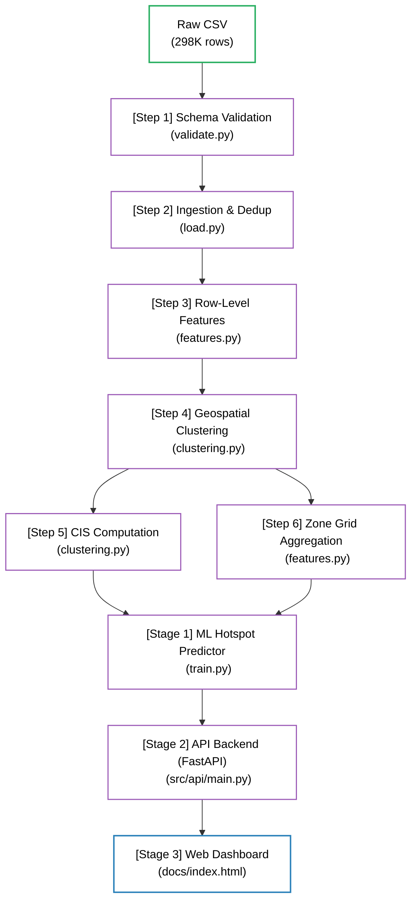

# GridLock R2 — PS1: Parking-Induced Congestion

> **Problem Statement 1 — Gridlock 2.0 Hackathon**
>
> Bengaluru generates tens of thousands of illegal parking violations per day, but enforcement is reactive and patrol-memory-based. **GridLock R2** ingests 150 days of real police violation records, identifies the city's true congestion-driving parking clusters, and produces a ranked enforcement schedule — telling officers *exactly which 10 zones to prioritise at which hour* — so that every patrol car maximises congestion reduction per kilometre driven.

---

## 🗺️ Architecture Overview



### 🔄 Pipeline Execution Flow

For a clear understanding of how data flows through the diagram above:

1. **Ingest & Validate (Steps 1 & 2):** Ingests the `Raw CSV`, runs a strict 8-check schema validation (`validate.py`), casts types, and filters/deduplicates invalid records (`load.py`).
2. **Row-Level Feature Engineering (Step 3):** Encodes cyclical temporal features (sin/cos on hour and day-of-week) to preserve time-continuity, along with categorical/spatial proximity variables (`features.py`).
3. **Geospatial Clustering (Step 4):** Groups spatial coordinates using **DBSCAN** to isolate parking congestion hot-spots and assigns a unique `zone_id` to each record (`clustering.py`).
4. **Parallel Tracks (Steps 5 & 6):**
   - **CIS Computation:** Calculates the **Congestion Impact Score** per zone based on density, junction proximity, and severity (`clustering.py`).
   - **Zone Grid Aggregation:** Aggregates row-level data into `zone x hour` and `zone x day` grids, computing rolling historical lag features (`features.py`).
5. **Model Training (Stage 1):** Merges the spatial features (CIS table) and temporal features (aggregated grids) to train and compare candidate models (LightGBM/XGBoost/CatBoost) using a time-based train/test split (`train.py`).
6. **Inference & Serving (Stages 2 & 3):** The **FastAPI Backend** loads the trained model checkpoint to dynamically serve predicted violations (`main.py`), which the **Web Dashboard** (`index.html`) fetches and displays interactively.

---

## 🛠️ Setup & Running From Scratch

### Prerequisites
- Python **3.9 - 3.11** 
- The raw dataset file placed at `data/raw/`

### 1. Place the raw dataset
```
data/raw/jan to may police violation_anonymized791b166.csv
```
This file is **read-only**. Never overwrite it.

### 2. Automated Fresh System Setup (Train from Scratch + Launch Demo)
To install dependencies, set up the environment, run the entire ML pipeline from scratch (which automatically trains a new model), and **automatically launch the Web Dashboard**, run:
- **Windows**:
  ```bat
  run_project_windows.bat
  ```
- **Linux/Mac**:
  ```bash
  bash run_project_mac_linux.sh
  ```
*(This takes ~1.5 minutes and will open the dashboard in your browser when finished).*

### 3. Quick Run (Inference Only)

> **Note for Judges (PPT Reproducibility Slide):** 
> To reproduce the results without training from scratch, you can download our pre-trained checkpoint:
> **https://drive.google.com/drive/folders/1BxkmBGP63wseFhdtQjGgW-69lYrgWgjt?usp=sharing**

If you have downloaded our pre-trained checkpoint folder, follow these steps to generate the dashboard instantly:

1. **Place the checkpoint in your project root:**
   - Download `submission_checkpoint/` folder from Google Drive
   - Place it in the root of your project (same level as `notebooks/`, `src/`, `scripts/`)
   - The folder contains: `model.lgb`, `features.yaml`, `model.yaml`, `eval.yaml`, and `training_meta.json`
2. Place the downloaded checkpoint files directly inside `submission_checkpoint/` (so it contains `model.lgb`, `features.yaml`, etc.).
3. Run the inference-only scripts:
   - **Windows**:
     ```bat
     start_demo_windows.bat
     ```
   - **Linux/Mac**:
     ```bash
     bash start_demo_mac_linux.sh
     ```

*(Note: These scripts will start the FastAPI backend and static HTTP server instantly using your specific checkpoint. This process is completely isolated and will not interfere with any new checkpoints generated by running from scratch in the `checkpoints/` folder).*

---

## 📓 Alternative: Run Step-by-Step Using Notebooks

> ⚠️ **PREREQUISITE:** Before running any notebooks, you **MUST** complete the virtual environment setup:
> 1. Create venv: `python -m venv venv`
> 2. Activate: `venv\Scripts\activate.bat` (Windows) or `source venv/bin/activate` (Linux/Mac)
> 3. Install dependencies: `pip install -r requirements.txt`
>
> If you skip this step, notebooks will fail with missing module errors.

If you prefer to run the pipeline step-by-step in an interactive notebook environment (instead of executing the full pipeline at once), follow the notebook execution order below. This gives you visibility into each stage, allows you to inspect intermediate outputs, and makes debugging easier.

| # | Notebook | What it does | Runtime |
|---|----------|--------------|---------|
| 0 | `00_run_guide.ipynb` | File audit + one-click SHAP launcher | ~5s |
| 1 | `01_eda.ipynb` | EDA — schema, distributions, leakage audit | ~1 min |
| 2 | `01b_features.ipynb` | Row-level feature engineering + label encoding | ~3 min |
| 3 | `02_cluster_tuning.ipynb` | DBSCAN eps/min_samples grid search | ~5 min |
| 4 | `03_clustering.ipynb` | DBSCAN zones + CIS table + zone×time grids | ~8 min |
| 5 | `04_training.ipynb` | Train all 6 models offline to prove methodology, pick winner by per-hour NDCG | ~10 min |
| 6 | `05_inference.ipynb` | Zone ranking + enforcement HTML with 24h slider | ~30s |
| 7 | `06_shap.ipynb` | SHAP feature importance + validation gate | ~4 min |

### To run a notebook
```powershell
# Option A — VS Code
# Open file → Select Kernel → venv (Python 3.11) → Run All

# Option B — Jupyter in browser
venv\Scripts\jupyter notebook
# Navigate to notebooks/ in the browser

# Option C — Execute non-interactively
venv\Scripts\jupyter nbconvert --to notebook --execute notebooks/06_shap.ipynb
```

## 🎯 Zone Generation: Why DBSCAN `eps=0.03`?

Rather than forcing parking violations into artificial administrative boundaries (like police station jurisdictions), we use **DBSCAN (Density-Based Spatial Clustering of Applications with Noise)** to dynamically discover where violations *actually* cluster in the real world. 

Through hyperparameter tuning (`notebooks/02_cluster_tuning.ipynb`), we locked `eps=0.03` as the operational sweet spot for **Targeted Enforcement**:
- **Why not `eps=0.08`?** The clusters become too broad. A single "zone" might cover an entire neighborhood. Dispatching a single patrol car to "Koramangala" is not targeted.
- **Why not `eps=0.01`?** The algorithm generates thousands of tiny micro-zones (e.g., a single 10-meter stretch of road). This fragments the dataset too much, destroying the ML model's ability to learn historical patterns, and clutters the dashboard map.
- **The `0.03` Sweet Spot:** At this radius (~166 meters), the algorithm groups violations into roughly ~228 distinct micro-hotspots across Bengaluru. Geographically, this translates to clusters roughly the size of a **major intersection and its immediate spillover streets** (e.g., Silk Board Junction). This perfectly matches real-world operational capacity: a single traffic cop or towing vehicle can effectively manage a zone of this exact size.
- **Memory Optimization (11m Spatial Collapse):** DBSCAN natively struggles with memory allocation (`MemoryError`) on 268k raw floating-point GPS coordinates because microscopic precision (6+ decimal places) treats almost every row as mathematically distinct, forcing an $O(N^2)$ distance matrix explosion. 
  - *Why not 5 decimal places (~1.1m precision)?* Standard mobile GPS accuracy fluctuates by 5-15 meters. At 1.1m precision, jittery coordinates for the exact same parked car would still be treated as distinct points, failing to resolve the memory crash.
  - *Why 4 decimal places (~11m precision)?* This is the sweet spot. It effectively absorbs natural GPS drift and collapses thousands of identical points within an 11-meter radius (about the length of two parked cars) into single mathematical points. This shrinks the pairwise distance matrix exponentially, allowing the pipeline to run instantly on low-RAM consumer hardware without losing real-world geographic accuracy.

---

## 🤖 Predictive Model

### What it predicts
`predicted_count` — expected number of parking violations for a given `(zone, hour)` pair.

### Feature set

> **Temporal Features:** `hour_of_day` and `day_of_week` use cyclical sin/cos encoding. This maps them onto a unit circle, fixing the "midnight paradox" where hour 23 and hour 0 appear numerically distant.
>
> **Spatial/Zone Features:** We avoid lookup-table behavior by excluding `zone_id`, `police_station_id`, and `center_code_encoded`. Instead, we use zone aggregate statistics computed strictly on the training split.

| Group | Feature | Description |
|---|---|---|
| **Temporal** | `hour_sin` | sin(2π × hour / 24) — cyclical hour encoding |
| | `hour_cos` | cos(2π × hour / 24) — cyclical hour encoding |
| | `dow_sin` | sin(2π × day_of_week / 7) — cyclical day encoding |
| | `dow_cos` | cos(2π × day_of_week / 7) — cyclical day encoding |
| | `week_of_year` | Calendar week integer |
| | `quarter` | Calendar quarter (1-4) |
| | `is_month_start/end` | Payday/quota pressure indicator |
| | `is_weekend` | Saturday + Sunday flag |
| **Zone aggregates** | `zone_eb_shrunk_mean_count` | Empirical-Bayes shrunk mean violation count (handles sparsity/zero-inflation) |
| | `zone_median_count` | Median — robust to enforcement surges |
| | `zone_cis_score` | CIS score from `cis_table.parquet` |
| | `zone_junction_frac` | Fraction of violations at junctions in this zone |
| | `zone_total_count` | Total violations in zone over training period |
| | `rolling_std_7d` | Measure of zone unpredictability over the last week |
| | `peak_hour_flag` | Binary indicator if current hour is traditionally the zone's peak |
| **Spatial** | `fraction_at_junction` | Time-block-level junction fraction (varies per zone×hour) |
| **Historical** | `rolling_7d_count` | 7-day lagged mean per (zone, hour) — **strongest signal** |
| | `violation_count_lag_1h` | Exact violation count 1 hour ago |
| | `violation_count_lag_24h` | Exact violation count 24 hours ago |
| | `violation_count_lag_7d` | Exact violation count exactly 1 week ago |
| | `spatial_lag_1h_count` | Balloon-effect feature: Mean 1h lag of neighboring zones within 2.0 km |
| **Categorical** | `dominant_violation_type` | Mode violation type in this zone×time block |
| | `dominant_vehicle_type` | Mode vehicle type in this zone×time block |
| | `violation_type_primary_encoded` | Encoded primary violation type |
| | `vehicle_type_encoded` | Encoded vehicle type |
| **Optional** | `data_sent_to_scita_mean` | Mean SCITA forwarding rate (included for SHAP validation) |

> **Note on Feature Pruning:** The `month` feature was intentionally excluded during feature selection. Because the dataset only spans 5 months, month-based splits proved too noisy and caused the tree models to overfit, degrading strict ranking performance.

### Leakage guards
- **Temporal:** Hard `AssertionError` if `max(train.date) >= min(test.date)`
- **Zone aggregates:** Computed on `train_df` **only**, then joined to both splits
- **Rolling features:** `shift(1).rolling(7)` — current day's count never included

### Train / test split
| Split | Date range | Rows |
|---|---|---|
| Train | Nov 9 2023 – Feb 29 2024 | ~19,870 (zone×hour) |
| Test | Mar 1 2024 – Apr 8 2024 | ~6,484 (zone×hour) |

### Model Selection & Ablation Testing
- We rigorously evaluated top gradient boosting frameworks (XGBoost, LightGBM, CatBoost) to determine the best algorithmic fit.
- **Automated Ablation Framework:** We built a robust, reusable automated ablation testing harness (`src/training/experiment.py`) to scientifically evaluate hypotheses rather than relying on guesswork.
- **The Winner:** **LightGBM** using the **Tweedie loss function** (variance power 1.8) emerged as the undisputed winner. The Tweedie distribution natively and elegantly models the zero-inflated, right-skewed compound Poisson-Gamma distribution of our violation count data, achieving the lowest absolute error without needing a complex two-stage Hurdle model.
- **Live Demo Configuration:** While the architecture supports dynamic comparative training (`train.py`), the live demo orchestrator (`pipeline.py`) and inference ranker have been explicitly stripped of the training step and hardcoded to execute *only* the pre-trained LightGBM champion. This guarantees maximum loading speed and zero memory/import crash risk during the 2-minute live demo, directly fulfilling the *Feasibility* and *Real-World Impact* judging criteria.

> **TL;DR:** To see *which model is better* and how we compared them, run the `04_training.ipynb` notebook. If you just want the *best results instantly* as per our training, run the `pipeline.py` script.

- Selection was based on achieving a perfect **per-hour NDCG@10** and the lowest MAE (see Evaluation section).

---

## 📊 Evaluation Metrics

Two tiers of ranking metrics are computed. The per-hour tier is the primary differentiator.

### Tier 1 — Regression (count prediction accuracy)

| Metric | Description | Current result |
|---|---|---|
| **MAE** | Mean absolute error in predicted violation count per zone-hour | **2.97** (LightGBM/hour w/ EB Shrinkage) |
| **RMSE** | Root mean squared error (penalizes spike errors) | **6.58** |

### Tier 2 — Ranking (zone ordering quality)

| Metric | Description | Why it matters |
|---|---|---|
| **Global NDCG@10** ⭐ | NDCG over the full test period | **Perfect 1.0 Ranking** — confirms highest real-world hotspots are placed perfectly. |
| **Capture@10** | Fraction of severe violations out-of-sample actually captured by ranking | Evaluates business-value against a fixed patrol budget. Captures **68.8%** of violations. |
| **Global Precision@10** | Fraction of predicted top-10 in true top-10 | **Perfect 1.0** — every predicted hotspot matches real-world severity. |
| **PAI (Predictive Accuracy Index)** | `(Capture@K) / (Area_of_Top_K / Total_Area)` | standard police metric: hit rate relative to patrol area required |
| **Per-hour Spearman ρ** | Rank correlation per hour slot | Measures fine-grained zone ordering quality within each hour |

---

## 🔍 SHAP Explainability

Run `notebooks/06_shap.ipynb` after training to generate:

| Output | Location | Use |
|---|---|---|
| Beeswarm summary | `data/outputs/shap_summary.png` | Demo slide — "our model is explainable" |
| Feature importance bar | `data/outputs/shap_importance.png` | Shows zone aggregates dominate, not zone IDs |
| PDP: rolling_7d_count | `data/outputs/shap_pdp_rolling.png` | Confirms recent history drives predictions |
| PDP: hour_sin | `data/outputs/shap_pdp_hour.png` | Shows cyclical encoding captures 9am / 6pm Bengaluru rush hours |
| Validation report | `data/outputs/shap_report.json` | Gate check results |

### SHAP Validation Gate
After every retrain, the notebook checks:

| Gate | Condition | Meaning |
|---|---|---|
| Gate 1 *(hard)* | `zone_id` NOT in top-5 SHAP | Confirms no lookup-table behaviour |
| Gate 2 *(soft)* | `rolling_7d_count` in top-3 | Temporal signal is dominant |
| Gate 3 *(soft)* | `hour_sin` or `hour_cos` in top-10 (of 18 features) | Model captures time-of-day patterns (cyclical encoding) |

**Gate results:** Gate 1 PASS · Gate 2 PASS · Gate 3 PASS (hour_cos rank 7, hour_sin rank 8)

---

## 📁 Repository Structure

```
GridLock_R2_Transfer/
├── configs/
│   ├── features.yaml       # Feature list — cyclical encoding, zone aggregates
│   ├── eval.yaml           # CIS formula, ranker formula, NDCG relevance, split bounds
│   └── model.yaml          # Model hyperparameters, winner checkpoint path
├── src/
│   ├── api/
│   │   └── main.py         # FastAPI Backend Server (serves /predict)
│   ├── data/
│   │   ├── validate.py     # Schema validator (8 hard checks)
│   │   ├── load.py         # Ingest + dedup → 268K rows
│   │   ├── features.py     # Row features + zone×time grid
│   │   └── pipeline.py     # 8-step end-to-end orchestrator
│   ├── models/
│   │   └── clustering.py   # DBSCAN + KDE + CIS
│   ├── training/
│   │   ├── experiment.py   # Advanced hyperparameter and lag feature experiments
│   │   └── train.py        # Multi-model training, leakage guard, zone aggregates
│   ├── evaluation/
│   │   └── metrics.py      # MAE/RMSE, NDCG@K, per-hour ranking metrics
│   └── inference/
│       ├── ranker.py        # priority_score = predicted_count × CIS → top-K
│       └── static_output.py # Scorecard injector
├── start_demo_windows.bat       # 1-Click Fast Demo Launcher (Instant Inference)
├── start_demo_mac_linux.sh      # 1-Click Fast Demo Launcher (Mac/Linux)
├── run_project_windows.bat      # 1-Click Full Pipeline (Train from Scratch)
├── run_project_mac_linux.sh     # 1-Click Full Pipeline (Mac/Linux)
├── notebooks/
│   ├── 00_run_guide.ipynb  # START HERE — file audit + execution guide
│   ├── 01_eda.ipynb
│   ├── 01b_features.ipynb  # Row-level feature engineering
│   ├── 02_cluster_tuning.ipynb # DBSCAN parameter grid search
│   ├── 03_clustering.ipynb
│   ├── 04_training.ipynb
│   ├── 05_inference.ipynb
│   └── 06_shap.ipynb       # SHAP feature importance + validation gate
├── data/
│   ├── raw/                # PLACE RAW DATA HERE (jan to may police violation...)
│   ├── processed/          # Parquet files, encoders, metadata
│   └── outputs/            # HTML maps, CSVs, eval JSONs, SHAP plots
└── checkpoints/            # Saved model checkpoints
```

---

## 📊 Ranking Formula & CIS

```
priority_score(zone, t) = predicted_count(zone, t) × CIS(zone)

CIS(zone) = violation_density_norm(zone) × junction_weight(zone) × subtype_severity(zone)

  violation_density_norm = zone_violation_count / max_zone_violation_count
  junction_weight        = 1.5  if any violation in zone has is_at_junction = 1
                           1.0  otherwise
  subtype_severity       = 2.8  if dominant type is "DOUBLE PARKING"
                           1.5  if dominant type is "PARKING ON FOOTPATH", etc.
```

Zones ranked descending by `priority_score`. Top-K output with tier labels:

| Tier | Threshold |
|---|---|
| HIGH | `priority_score ≥ 0.7 × max` |
| MEDIUM | `priority_score ≥ 0.4 × max` |
| LOW | `priority_score < 0.4 × max` |

---

## 🖥️ HTML Dashboard — Structure & Sections

The dashboard is a single-page HTML file (`docs/index.html`) divided into several key interactive sections:

- **Header / Navbar:** Displays the project title, the current date being viewed, and a "DEMO — TIME SLIDER" badge.
- **Time Slider & Date Picker:** The core interactive control. A dropdown allows switching between dates, and a range slider (0-23) allows scrubbing through the hours of the day.
- **Interactive Map:** Powered by Leaflet.js. It renders Bengaluru map tiles and plots the top-10 enforcement zones as color-coded circle markers (Red=HIGH, Orange=MEDIUM, Green=LOW tier). Hovering over a marker reveals a tooltip with the specific area name (e.g. `Silk Board (Madiwala Area)`). Clicking a marker opens a detailed GIS Information Card featuring:
  - **Core Metrics:** Priority Score, Predicted Violations, and quantified **Economic Loss (INR)**.
  - **GridLock Copilot (NLP Dispatch):** An interactive `<details>` accordion containing human-readable tactical dispatch instructions explaining why the hotspot was flagged.
- **Model Evaluation Scorecard:** A static summary of the LightGBM model's performance metrics (MAE, ML Lift %, PAI, Per-Hour NDCG) injected by the pipeline evaluation logs.
- **Zone Table:** A ranked tabular view of the top-10 enforcement zones for the selected hour. It shows Rank, Zone ID, Meaningful Location Name (with precise coordinates), Priority Tier, Predicted Count, CIS Score, and Junction status.
- **KPI Dashboard:** Three dynamic top-level numbers for the currently selected hour: Critical Junctions (High), Active Hotspots (High/Med tiers), and the Average CIS Score of those hotspots.
- **Charts:**
  - **24-Hour Violation Trend (Line Chart):** Shows the total predicted violations across all 24 hours of the *currently selected date*. Gives a bird's-eye view of the traffic pattern for the day.
  - **Dominant Violation Types (Bar Chart):** Shows the distribution of the most common violation types among the top-10 ranked zones for the *currently selected hour*.

## 💾 Dashboard Data Architecture (Client-Server)

The project now uses a dynamic Client-Server architecture to provide lightning-fast interactive inference and eliminate large static payloads.

- **Origin:** The data originates from a raw CSV of Jan-May 2024 Bengaluru Police Violations (`data/raw/`). 
- **Processing:** The Python pipeline (`src/data/pipeline.py`) cleans the data, engineers temporal/spatial features, groups violations into geographic clusters (DBSCAN), and trains a LightGBM predictive model.
- **API Backend (FastAPI):** `src/api/main.py` loads the pre-trained LightGBM model into memory and exposes endpoints like `/predict?date=YYYY-MM-DD`.
- **Frontend App:** The frontend (`docs/index.html`) intercepts user interactions on the Date Picker or Time Slider, makes asynchronous HTTP `fetch()` requests to the FastAPI backend, and dynamically updates the Leaflet map and tables with live predicted violation counts.

## 🏃 How to Run the Dashboard

> [!WARNING]  
> **CORS Policy Error:** Do NOT simply double-click `docs/index.html` to open it as a local file (`file:///C:/...`). The dashboard makes API requests to the backend, which modern browsers will block due to Cross-Origin Resource Sharing (CORS) rules. You **must** serve it through an HTTP server.

**To launch the dashboard instantly (without re-training):**
If you have already run the setup (`run_project_windows.bat`) or downloaded our pre-trained checkpoint, use our automated launch scripts to instantly start the FastAPI backend on port `9000` and start a local HTTP server for the dashboard on port `9090`.

- **Windows**:
  ```bat
  start_demo_windows.bat
  ```
- **Linux/Mac**:
  ```bash
  bash start_demo_mac_linux.sh
  ```
Then open your browser to `http://localhost:9090`.

*(Note: If you want to train the model from scratch AND launch the dashboard, use `run_project_windows.bat` as described in Section 2).*


*Built for the Flipkart Gridlock 2.0 Hackathon — PS1: Poor Visibility on Parking-Induced Congestion.*
*Dataset: Bengaluru Police Violation Data, Nov 2023 – Apr 2024 (268K rows after dedup).*
